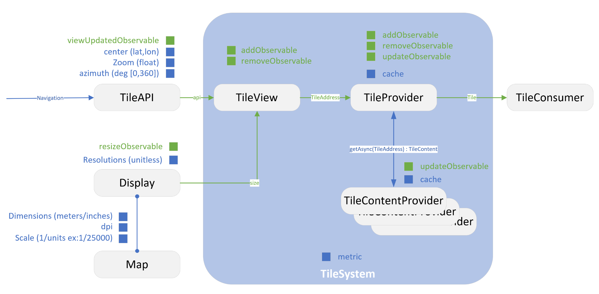

### TILE PIPELINE

In the dynamic world of web mapping, the efficacy and responsiveness of map interfaces are crucial for a seamless user experience. This documentation delves into the intricate workings of our web tile interface, particularly focusing on the pipeline that plays a pivotal role in fetching and displaying map tiles.

The core of this interface lies in its ability to intelligently retrieve map tiles based on a set of defined properties. These properties include the level of detail (LOD), the geographic center of the map, the dimensions and resolution of the user's screen, and the map scale. Each of these elements is essential in determining how the map is presented to the user, ensuring that the displayed information is both relevant and optimized for their viewing context.

At the heart of this process is the pipeline, a robust system engineered to handle the complexities of map rendering. It encompasses a series of steps, starting from interpreting the user's view settings, through selecting the appropriate tiles, to the final display on the user's device. This pipeline is not just about fetching data; it's about doing so efficiently and accurately, ensuring that the tiles match the specified LOD, align with the geographic focus, and fit the screen's dimensions and resolution perfectly.

This documentation aims to provide a comprehensive overview of this pipeline. It will guide you through each component of the system, explaining how the tiles are sourced, processed, and rendered. Whether you are a developer looking to understand the inner workings of our web tile interface, or someone keen on the technicalities of web mapping, this document is designed to provide you with a clear and detailed understanding of our technology and its capabilities.

---

**Overview of Pipeline Components**

1. **Tile Metrics**

    The foundational component of our tile system, Tile Metrics, establishes the system's definitions and properties. It is crucial for the following functionalities:

    - **Geographic Bounds**: Defines the geographical limits of the map system in terms of latitude and longitude.

    - **Level of Detail (LOD)**: Determines the resolution and detail of tiles, allowing for various zoom levels and scalability.

    - **Address and Coordinate Conversion**: Incorporates methods for translating between tile addresses and their geographic coordinates, essential for accurate mapping.

2. **View**

    The View component is tasked with selecting appropriate tile addresses, guided by the Tile Metrics and navigation properties. Its role is expanded to include the following:

    - **Tile Selection Based on Navigation Properties**: Considers the geographic center, azimuth, and level of detail in tile selection, ensuring relevance and accuracy.

    - **Dimension and Scalability**: Defines the dimension in unitless TileXY units, enabling flexibility and adaptability to different screen sizes and resolutions.

    - **Event Management Through Observable Pattern**: Crucially, the View is responsible for managing events using the observable pattern. It sends notifications about 'Added' and 'Removed' TileAddresses, allowing other components of the system to react and update accordingly. This feature is vital for ensuring that the system remains dynamic and responsive to changes, such as user navigation or zoom adjustments.

3. **TileProvider**

    The TileProvider acts as a critical intermediary between the View and the TileContentProvider. Its responsibilities include:

    - **Observing View Events**: The TileProvider is tasked with observing events generated by the View, particularly those related to tile addition or removal.

    - **Synchronization with TileContentProvider**: Upon receiving events from the View, the TileProvider synchronizes these with the TileContentProvider. This synchronization ensures that the content of the tiles is in line with the changes in the View.

    - **Managing Tile Events**: Once the TileContent is ready, the TileProvider takes over the role of event management. It uses the observable pattern to handle 'Add', 'Remove', and 'Update' tile events. The 'Update' event is particularly significant in the context of asynchronous content loading, allowing the system to dynamically update tiles as new content becomes available or as user interactions necessitate changes.

4. **TileContentProvider**

    The TileContentProvider is a crucial component that interfaces with the data source. Its responsibilities include:

    - **Data Source Connection**: Typically connected to remote tile servers (although not exclusively), it manages the content for a given tile address.

    - **Content Management and Transformation**: The provider is responsible not only for managing tile content but also for applying local strategies like resampling or dynamic content creation. This adaptability allows it to meet diverse and specific content requirements.

    - **Support for Multiple Providers**: There can be several Tile Content Providers for a single Tile Provider, allowing for a versatile and robust system capable of handling various content sources and types.

    - **Observable Property Exposition**: The TileContentProvider exposes an observable property, keeping users informed about updates or the readiness of specific tiles. This feature is particularly important due to the asynchronous nature of the component, ensuring that updates and changes in tile content are communicated effectively and in real-time.

5. **TileConsumer**

    Positioned at the end of the pipeline, the TileConsumer plays a pivotal role:

    - **Observing Incoming Tiles**: The primary function of the TileConsumer is to observe and process the incoming tiles from the TileProvider. It acts as the final recipient of the tile data, ready for rendering or further manipulation.

    - **Rendering and Usage**: Depending on its implementation, a typical TileConsumer might be a Canvas 2D renderer, translating tile data into visual representations on a flat canvas. Alternatively, it could be a more complex 3D Mesh builder, which integrates the tile data into a 3D scene. This versatility allows the TileConsumer to cater to a wide range of applications, from simple map displays to sophisticated 3D geographical visualizations.
